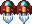

# Shooter Game
This project is an RPG shooter game built with Phaser 3, a JavaScript game framework designed to create 2D games.

## Built With

- HTML/CSS
- JavaScript
- Phaser 3
- Webpack
- Leaderboard API service
- Jest

## How to play

- Drive the shooter jet with your keyboard arrows.

  *  ⬅️ - Press the left arrow key to move left.
  * ➡️ - Press the right arrow key to move right.
  * ⬆️ - Press the up arrow key move up.
  * ⬇️ - Press the down arrow key to move down.
- Use the spacebar to shoot the desert enemy beasts to gain points.
- Avoid getting shot or colliding with the enemy.

## Game Design
- I used the [space shooter pack](https://opengameart.org/content/space-ship-shooter-pixel-art-assets) from ansimuz for the background, player shooter jet, explosion, lasers and bolts.
- I used a [flying dragon beast sprite](https://opengameart.org/content/flying-dragon-rework) from AntumDeluge.
- I used a [battle theme](https://opengameart.org/content/battle-music) background music from Alexandr Zhelanov.

#### Player Shooter Jet

#### Player Shooter Jet Laser

#### Dragon Beast Enemy

#### Dragon Beast Laser

#### Game Screen

#### Loading Screen

#### Menu Screen

#### Instuctions Screen

#### Credits Screen

#### Leaderboard Screen

#### GameOver Screen

## Live Demo
 [Link to live demo](https://mupa-shooter-game.netlify.app/) 

## Getting Started

To get a copy up and running follow these simple example steps:-
- Clone `https://github.com/Mupa1/rpg-shooter-game` to your local machine.
- Run `npm install` to install dependancies.
- cd into the rpg-shooter-game directory and run `npm run start` to open the game in the browser.

To make changes open rpg-shooter-game directory in you favorite editor.
- Navigate to src folder to make any changes.
- To preview changes live, run npm start from your terminal to open the game in the browser.
- When you finish your changes, run npm run build to create the production files to the dist folder.

## Automated Test
 > npm run test

 ## Potential future features
 - Add Enemies.
 - Extend gameplay functionality.

## Author

👤 **Mupa M'mbetsa Nzaphila**

- Github: [@mupa1](https://github.com/Mupa1)
- Twitter: [@mupa_mmbetsa](https://twitter.com/mupa_mmbetsa)
- Linkedin: [mupa-mmbetsa](https://www.linkedin.com/in/mupa-mmbetsa)

## 🤝 Contributing

Contributions, issues and feature requests are welcome!

Feel free to check the [issues page](https://github.com/Mupa1/rpg-shooter-game/issues).

## Show your support

Give a ⭐️ if you like this project!
